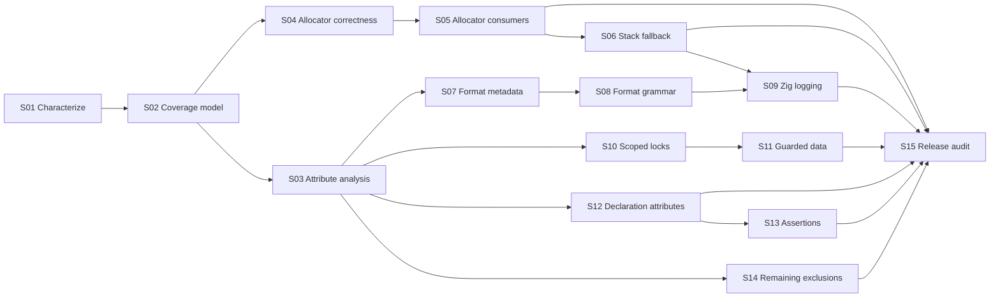

# Intentional-exclusion implementation roadmap

This is a living implementation plan for every entry under **Intentional exclusions** in
`COVERAGE.md`. The goal is not to manufacture a Zig declaration for each C macro. The goal is to
carry every useful contract into one of four honest outcomes:

1. a direct Zig equivalent;
2. semantic metadata that changes generated bindings;
3. a clearly additive Zig-native facility; or
4. a documented exclusion when Zig has no corresponding contract.

A no-op helper is not a port of a C declaration attribute, preprocessor query, or linker directive.
Likewise, an additive scoped-lock, allocator, logging, or assertion API must not be counted as a
direct macro binding merely because it was motivated by an excluded macro.

The pinned baseline used for this investigation is SDL 3.4.12, Zig 0.16.0, Clang 19.1.7, and CastXML
0.7.0. Re-run the inventory when any of those inputs change.

## Rules for implementation and coverage

- Treat a macro definition, an application of that macro to a declaration, and the useful Zig
  behavior derived from that application as three different things.
- Preserve the raw `c` import as the ABI authority. Put higher-level policy in `scripts/codegen/`,
  never in hand-edited generated modules.
- Derive behavior from recurring declaration shape, parsed attributes, and documentation. Do not
  introduce a release-specific list of SDL function names when semantic metadata can express the
  rule.
- Keep raw operations when an additive safer operation is introduced. For example, adding a scoped
  mutex guard must not hide the direct lock/unlock bindings.
- Fail generation when a recognized contract is malformed or cannot be represented safely. Do not
  silently fall back to name guessing.
- Keep direct, indirect, semantic, and additive coverage separate. An exclusion can remain a direct
  exclusion even after its applications improve the generated API.

Coverage needs two axes rather than one overloaded status. The inventory axis preserves the current
numerator and denominator:

| Inventory status | Meaning                                                                   |
| ---------------- | ------------------------------------------------------------------------- |
| Covered          | A public Zig declaration preserves the entry's consumer-visible contract. |
| Intentional      | Policy deliberately omits a standalone declaration.                       |
| Limitation       | A useful, representable contract is still unimplemented.                  |

The contract-handling axis records what happens after an intentional exclusion:

| Handling        | Meaning                                                                          | Example                            |
| --------------- | -------------------------------------------------------------------------------- | ---------------------------------- |
| Direct          | A public Zig declaration preserves the macro's consumer-visible contract.        | `SDL_UINT64_C` -> `stdinc.uint64c` |
| Indirect        | A generated wrapper consumes the C mechanism, but no standalone value is useful. | thread begin/end hooks             |
| Semantic        | An attribute changes analysis, planning, rendering, or validation.               | a format or lock effect            |
| Additive        | A Zig-native API provides related value without claiming macro compatibility.    | scoped lock guards                 |
| Unrepresentable | No honest consumer-facing or generator operation exists.                         | token stringification              |

These axes are deliberately not interchangeable. For example, `SDL_ACQUIRE` remains **Intentional**
in the inventory while its applications can have **Semantic** handling and its generated guards can
have an **Additive** relation. The report may show all three facts, but only a genuine direct
declaration changes the direct coverage percentage.

## Current-state evidence

The current tree is ahead of the old exclusion narrative in several areas:

- `src/sdl.zig` already exposes an SDL-backed `std.mem.Allocator` as `sdl.allocator`.
- `sdl.AllocatorBridge.install` already installs a consumer allocator through
  `SDL_SetMemoryFunctions`.
- 50 generated core APIs already accept `std.mem.Allocator` for copied, caller-owned results.
  Passing `sdl.allocator` is valid today, although this is not documented or broadly tested.
- The generator already emits comptime C-format parsing and default argument promotion for generated
  variadic SDL/SDL_test wrappers. It also emits `std.builtin.VaList` wrappers.
- `SDL_CreateThread` and `SDL_CreateThreadWithProperties` already pass `c.SDL_BeginThreadFunction`
  and `c.SDL_EndThreadFunction` to the runtime entry points.
- SDL thread-safety text is retained in generated documentation.
- The generated API already uses Zig builtins for byte swapping, checked size addition and
  multiplication, breakpoint helpers, and several other macro bodies.

Those implementations need characterization and hardening before new surfaces are added. The most
important known gaps are:

| Area                         | Current gap                                                                                                                                                      |
| ---------------------------- | ---------------------------------------------------------------------------------------------------------------------------------------------------------------- |
| Allocator bridge ABI         | Callbacks hard-code `c_ulong`; SDL declares `size_t`, which is not the same ABI type on 64-bit Windows.                                                          |
| SDL allocator alignment      | The allocator selects `SDL_malloc` up to `max_align_t`, but SDL only guarantees `min(alignof(max_align_t), 2 * sizeof(void *))`.                                 |
| Allocator recursion          | Installing `sdl.allocator` as SDL's own backing allocator recurses through `SDL_malloc`.                                                                         |
| Allocator installation proof | `SDL_GetNumAllocations` can return `-1`, and zero proves only that no counted allocations remain, not that SDL has never allocated.                              |
| Allocator tests              | The bridge fixture runs natively and does not prove callback ABI, alignment thresholds, or compilation across the full target matrix.                            |
| Format source of truth       | Format kind is guessed from `name.includes("scanf")`; the format parameter is assumed to be the final fixed argument.                                            |
| Format completeness          | The parser does not yet model the full SDL-supported printf/scanf grammar, especially scanf `hh`/`h`, `%n` length, positional arguments, and difficult scansets. |
| Format tests                 | Existing semantic tests mostly check generated text. They do not compile a matrix of valid and invalid calls.                                                    |
| Lock metadata                | CastXML erases the thread-safety attributes in the normal analysis configuration.                                                                                |
| Declaration attributes       | Most visibility, format, deprecation, analyzer, and result-use attributes are not represented in the semantic model.                                             |

These are plan prerequisites, not reasons to discard the existing work.

## Shared attribute-analysis foundation

Allocator annotations, format checking, lock effects, and declaration attributes should use one
supplemental semantic pipeline.

### Why CastXML alone is insufficient

CastXML records ordinary declaration shape and marks static inline functions, but its current XML
does not retain the contracts needed here. For example, it omits Clang `FormatAttr`, capability
effects, `AnalyzerNoReturnAttr`, and their arguments.

A Clang AST pass proves that the information is available:

- with `SDL_THREAD_SAFETY_ANALYSIS=1`, the eight annotated mutex/RW-lock declarations contain
  acquire, try-acquire, shared/exclusive, and release attributes;
- each capability attribute contains a reference to the affected parameter;
- format declarations contain `FormatAttr`; and
- `SDL_ReportAssertion` contains `AnalyzerNoReturnAttr`.

Clang's JSON AST omits some normalized attribute arguments. Its macro expansion location points back
to the exact public-header invocation, however. The analyzer can combine the typed AST node with the
source token at that expansion location to distinguish, for example, `SDL_ACQUIRE_SHARED` from
`SDL_ACQUIRE` and `SDL_PRINTF_VARARG_FUNC(3)` from its `FUNCV` form.

### Semantic model

Add normalized metadata in `scripts/codegen/analysis.ts` instead of making rendering inspect raw
Clang JSON. The model should be equivalent to:

```text
DeclarationSemantics
  linkage: default | imported | exported | hidden
  deprecated: optional message/replacement
  inline: none | hint | always
  returnFlow: normal | no_return | analyzer_no_return
  resultUse: ordinary | should_use
  format: optional FormatContract
  lockEffects: zero or more LockEffect

FormatContract
  dialect: printf | scanf
  formatParameter: zero-based parameter index
  firstVariadicParameter: zero-based index | va_list

LockEffect
  kind: acquire | try_acquire | release | require | exclude | assert | return | order
  mode: exclusive | shared | generic
  capability: parameter(index) | declaration(identity) | return_value | this
  successValue: optional boolean
```

Use names appropriate to the repository, but preserve these distinctions.

### Acquisition and merge steps

1. Add a focused Clang-attribute command beside the CastXML and preprocessor commands in
   `analysis.ts`. It must reuse the same include paths, target identities, defines, and public
   source filtering.
2. Run the supplemental pass with `SDL_THREAD_SAFETY_ANALYSIS=1`. Do not add this define to the
   ordinary ABI pass; the joystick header intentionally exposes an analyzer-only, non-linkable
   symbol under that define.
3. Traverse Clang JSON and retain only public declarations and recognized attribute nodes. Read
   macro provenance from expansion locations when Clang does not serialize a needed argument.
4. Match supplemental declarations to CastXML declarations by normalized file, line, name, and
   signature. Never persist Clang process-local pointer IDs.
5. Merge metadata across the configured target matrix. Record legitimate target variation and fail
   on contradictory semantic contracts.
6. Pass normalized metadata through `analysis.ts` and `function-plan.ts`; rendering must not
   rediscover it from function names or comments.
7. Add a small synthetic header fixture containing every supported attribute kind and malformed
   cases. Test parameter-index conversion carefully because the C macros use one-based indexes.
8. Add an inventory assertion for the pinned SDL baseline so an upstream attribute addition is a
   reviewed change instead of silently ignored input.

Do not parse Clang's human-readable AST dump. It is useful for investigation but is not a stable
machine interface.

## Regression work for the 13 existing direct ports

The already-covered macros still need contract tests so later semantic work does not regress them:

| Entries                                                     | Evidence to add or retain                                                                                                                                                                                                          |
| ----------------------------------------------------------- | ---------------------------------------------------------------------------------------------------------------------------------------------------------------------------------------------------------------------------------- |
| `SDL_COMPILE_TIME_ASSERT`                                   | Positive compilation and a negative fixture that checks the supplied diagnostic name.                                                                                                                                              |
| `SDL_const_cast`, `SDL_reinterpret_cast`, `SDL_static_cast` | Valid pointer/value conversions plus compile failures for invalid target types; no hidden runtime evaluation.                                                                                                                      |
| `SDL_SINT64_C`, `SDL_UINT64_C`                              | Boundary literals and exact `i64`/`u64` result types at comptime.                                                                                                                                                                  |
| `SDL_PRILLd`, `SDL_PRILLu`, `SDL_PRILLx`, `SDL_PRILLX`      | Target-selected strings compared with the C import for every ABI in the matrix.                                                                                                                                                    |
| `SDL_TriggerBreakpoint`, `SDL_AssertBreakpoint`             | Compile on every target and run only in a debugger/subprocess-safe fixture. Preserve the caller-visible break location.                                                                                                            |
| `SDL_CompilerBarrier`                                       | Prove the documented compiler-ordering contract. The current implementation calls SDL's acquire-barrier function; do not describe it as a Zig primitive without inspecting code generation and ordering on the pinned Zig version. |

Keep these as direct coverage only while the release-result tests prove their actual contract. A
name existing in a namespace is not sufficient evidence.

## Workstream A: Zig-specific lock and capability system

### Upstream scope

SDL defines 20 public thread-analysis macros, but this baseline applies them to only eight public
functions, all in `SDL_mutex.h`:

| Declaration                   | Semantic effect                                        |
| ----------------------------- | ------------------------------------------------------ |
| `SDL_LockMutex`               | acquire `mutex` exclusively                            |
| `SDL_TryLockMutex`            | acquire `mutex` exclusively when the result is `true`  |
| `SDL_UnlockMutex`             | release `mutex` exclusively                            |
| `SDL_LockRWLockForReading`    | acquire `rwlock` shared                                |
| `SDL_LockRWLockForWriting`    | acquire `rwlock` exclusively                           |
| `SDL_TryLockRWLockForReading` | acquire `rwlock` shared when the result is `true`      |
| `SDL_TryLockRWLockForWriting` | acquire `rwlock` exclusively when the result is `true` |
| `SDL_UnlockRWLock`            | release `rwlock` in either mode                        |

The other macro kinds are currently definitions for consumers; no SDL declaration in this header set
applies them. The semantic model still needs to support them so an upstream use is not lost.

The complete planned mapping is:

| Macro                           | Normalized meaning                          | Zig-specific handling                                     |
| ------------------------------- | ------------------------------------------- | --------------------------------------------------------- |
| `SDL_CAPABILITY`                | declaration names a capability              | Guarded owner/lock identity                               |
| `SDL_SCOPED_CAPABILITY`         | value owns a scoped acquisition             | Generated guard type                                      |
| `SDL_GUARDED_BY`                | value access requires capability            | Private `Guarded(T)` data exposed through guard           |
| `SDL_PT_GUARDED_BY`             | pointee access requires capability          | Guard/token-checked pointer accessor                      |
| `SDL_ACQUIRED_BEFORE`           | lock-order edge                             | Optional rank/order validation                            |
| `SDL_ACQUIRED_AFTER`            | reverse lock-order edge                     | Optional rank/order validation                            |
| `SDL_REQUIRES`                  | exclusive capability required on entry/exit | Exclusive guard/token parameter                           |
| `SDL_REQUIRES_SHARED`           | shared capability required on entry/exit    | Read or exclusive guard/token parameter                   |
| `SDL_ACQUIRE`                   | exclusive acquisition                       | Exclusive guard constructor                               |
| `SDL_ACQUIRE_SHARED`            | shared acquisition                          | Read-guard constructor                                    |
| `SDL_RELEASE`                   | exclusive release                           | Exclusive guard release/deinit                            |
| `SDL_RELEASE_SHARED`            | shared release                              | Read-guard release/deinit                                 |
| `SDL_RELEASE_GENERIC`           | either-mode release                         | Mode-specific guards calling the common release function  |
| `SDL_TRY_ACQUIRE`               | conditional exclusive acquisition           | Optional exclusive guard using annotated success value    |
| `SDL_TRY_ACQUIRE_SHARED`        | conditional shared acquisition              | Optional read guard using annotated success value         |
| `SDL_EXCLUDES`                  | capability must not be held                 | Runtime negative-capability check where identity is known |
| `SDL_ASSERT_CAPABILITY`         | assume/assert exclusive hold after call     | Tracker assertion and exclusive token production          |
| `SDL_ASSERT_SHARED_CAPABILITY`  | assume/assert shared hold after call        | Tracker assertion and read token production               |
| `SDL_RETURN_CAPABILITY`         | result aliases a capability                 | Capability accessor retaining identity                    |
| `SDL_NO_THREAD_SAFETY_ANALYSIS` | analyzer escape hatch                       | Explicit raw/unchecked path with no false safety claim    |

Clang's analysis is static and declaration-attached. Zig 0.16.0 has no equivalent declaration
attribute system, so the Zig feature should combine type-directed scoped locking with optional
runtime diagnostics. It must not be described as a complete port of Clang's analyzer.

### Phase A1: derive scoped operations from lock effects

Teach `function-plan.ts` to group matching acquire/try/release effects by capability parameter and
handle type. For the current SDL declarations, generate additive methods similar to:

```zig
var guard = mutex.lockScoped();
defer guard.deinit();

if (mutex.tryLockScoped()) |guard_value| {
    var guard = guard_value;
    defer guard.deinit();
}

var read_guard = rwlock.lockShared();
defer read_guard.deinit();

var write_guard = rwlock.lockExclusive();
defer write_guard.deinit();
```

The final names should be settled with the rest of the handle naming policy. Required contracts:

- `MutexGuard.deinit` calls the exact release operation for the same handle.
- `RwLockReadGuard` and `RwLockWriteGuard` remain distinct even though SDL uses one generic unlock
  function.
- Try-lock methods return `?Guard` only when the annotated success value matches.
- A guard has an explicit inactive state after manual release; a second release diagnoses misuse in
  safety-enabled builds.
- Condition-variable wait helpers accept a live mutex guard and retain it across SDL's atomic
  unlock/wait/relock operation.
- Destroy documentation and debug checks reject destruction while a tracked guard is live.
- Existing direct `lock`, `tryLock`, and `unlock` methods remain available for FFI parity and
  unusual control flow.

Zig values are copyable and `defer` is not mandatory. Document that a guard must not be copied, and
make debug tracking detect double release where possible. Do not claim Rust-like borrow checking.

### Phase A2: capability-protected Zig data

Add a separate, explicitly Zig-native generic layer after guards are stable:

- `mutex.Guarded(T)` owns or associates an SDL mutex with a private `T`.
- `mutex.RwGuarded(T)` exposes immutable access only through a read guard and mutable access only
  through a write guard.
- Accessor APIs require a guard/token tied to the same wrapper instance. Runtime safety checks
  verify identity because Zig cannot express that lifetime relationship in the type system.
- An external-lock variant may borrow an existing mutex, but its lifetime and destruction order must
  be explicit.
- A guarded value must not expose a public field that bypasses the capability.

This layer is the useful Zig counterpart for `SDL_CAPABILITY`, `SDL_GUARDED_BY`,
`SDL_PT_GUARDED_BY`, `SDL_REQUIRES`, and `SDL_REQUIRES_SHARED`. It is additive and should live in
generated support owned by the generic lock-effect rule, not in a handwritten SDL symbol table.

### Phase A3: optional runtime lock diagnostics

Provide a safety-enabled tracker only if it remains allocation-free on lock paths and compiles for
every configured target. It should track, per thread:

- capability identity;
- shared or exclusive mode;
- recursion depth;
- acquiring thread;
- optional rank/order; and
- source location of acquisition.

Use it to diagnose wrong-thread unlock, unbalanced release, illegal RW-lock recursion, read-to-write
upgrade, write-to-read nesting, destruction while held, and rank inversion. Rank support is the
runtime counterpart for `SDL_ACQUIRED_BEFORE` and `SDL_ACQUIRED_AFTER`. An explicit unchecked/raw
path is the counterpart for `SDL_NO_THREAD_SAFETY_ANALYSIS`.

`SDL_EXCLUDES`, `SDL_ASSERT_CAPABILITY`, `SDL_ASSERT_SHARED_CAPABILITY`, and `SDL_RETURN_CAPABILITY`
should map to tracker/token operations when an upstream declaration uses them. Do not invent
behavior for unused macro definitions.

### Lock-system validation

- Unit-test normalization of all 20 macro kinds with a synthetic header.
- Assert the eight pinned SDL effects listed above, including success value and shared/exclusive
  mode.
- Compile and run mutex recursion, try-lock success/failure, read/read coexistence, write exclusion,
  guard release, condition wait, and manual-release cases against a focused fake ABI.
- Add negative safety tests for copied/double-released guards, wrong-thread unlock, invalid RW-lock
  upgrade, and rank inversion.
- Confirm that the raw API remains source-compatible.
- Compile the generated guard surface for Linux, Windows, macOS/iOS/tvOS, Android, and Emscripten.

## Workstream B: allocator interoperability and stack-first allocation

There are three different directions and they need separate names and documentation:

1. **SDL to Zig:** `sdl.allocator` lets Zig containers allocate and free through the current SDL
   memory functions.
2. **Zig to SDL:** `AllocatorBridge` replaces SDL's process-wide memory callbacks with a permanent
   consumer `std.mem.Allocator`.
3. **Caller-scoped stack-first:** a caller-owned fixed buffer services small temporary allocations
   and falls back to `sdl.allocator` for larger ones.

The third option is the useful Zig answer to `SDL_stack_alloc`/`SDL_stack_free`; it is not a literal
macro port.

### Phase B1: harden `sdl.allocator`

1. Add the ordinary-allocation alignment guarantee to the allocator profile or derived semantic
   model. Select `SDL_malloc` only when the requested alignment is no greater than
   `min(@alignOf(std.c.max_align_t), 2 * @sizeOf(*anyopaque))`; otherwise use
   `SDL_aligned_alloc`/`SDL_aligned_free`.
2. Keep `remap` limited to allocations whose pairing remains valid. For over-aligned allocations,
   return `null` and let `std.mem.Allocator` allocate/copy/free through the normal fallback path.
3. Verify zero-length allocation and resize behavior against SDL's documented conversion of zero to
   one byte.
4. Test ordinary and over-aligned allocation, remap that moves, remap failure preserving the old
   allocation, free pairing, integer overflow, and OOM.
5. Expose the allocator only from the owning SDL module. Companion libraries should use or re-export
   the dependency by explicit policy instead of constructing incompatible allocators.

### Phase B2: harden the process-wide allocator bridge

1. Derive callback parameter types and calling convention from the imported SDL callback typedefs or
   function types. Remove `c_ulong` and unchecked function-pointer casts from the ABI boundary.
2. Reject direct installation of `sdl.allocator`; it calls `SDL_malloc` and would recurse into the
   bridge. Add a fixture proving rejection rather than waiting for stack overflow.
3. State that the backing allocator must be callable from every thread SDL may use. A
   non-thread-safe arena or fixed-buffer allocator is not valid as the process-wide backing
   allocator.
4. State that the backing allocator and its context must outlive the process. A stack-fallback
   allocator must never be installed globally.
5. Decide and document the allocation-count policy:
   - a positive count must reject installation;
   - `-1` means the check is unavailable and must not be described as proof of safety;
   - zero is an advisory outstanding-allocation check, not proof that no prior SDL call occurred.
6. Consider splitting an explicitly trusted first-call install from a checked install if one API
   cannot communicate those semantics cleanly. Preserve source compatibility if the existing
   `install` name remains.
7. Ensure callback failures translate to `NULL` without unwinding across C. Define debug behavior
   for a corrupt/foreign allocation header; silent leaks must not be the only diagnostic.
8. Add compile-time layout/alignment assertions for the bridge header and overflow tests for all
   header/padding/length arithmetic.
9. Verify `calloc` multiplication, zeroing, `realloc(NULL, n)`, in-place resize, move-and-copy,
   shrink, failure preservation, and exact free pairing.
10. Compile the callback fixture for every target and run it on native CI targets. The Windows
    compile is a release gate because it proves the `size_t` fix.

### Phase B3: prove every allocator-taking API is allocator-generic

The 50 current wrappers should accept `std.testing.allocator`, `sdl.allocator`, a fixed-buffer
allocator, and a stack-fallback allocator without special cases. Test at least one representative of
each generated ownership transformation:

- owned sentinel string;
- owned byte slice;
- count-terminated scalar list;
- list of copied strings;
- list of copied records containing strings;
- owned audio output/result structure; and
- owned variadic output such as `asprintf`.

For each case, verify success, OOM cleanup, deinitialization pairing, and absence of SDL-owned
pointers after the wrapper returns. Add a generator test that every caller-owned copy plan places a
`std.mem.Allocator` parameter first and retains it in owning result types that need `deinit`.

Passing `sdl.allocator` may currently allocate through SDL, copy through SDL again, and free the
source allocation. That is correct but potentially redundant. Treat zero-copy adoption as a later
optimization requiring allocator-identity, ownership, length, alignment, and failure tests; do not
make it part of the first correctness slice.

### Phase B4: expose a safe stack-first option

Prefer a small wrapper around Zig's caller-owned `std.heap.stackFallback` rather than `alloca`:

```zig
var scratch = sdl.stackFallbackAllocator(4096);
const allocator = scratch.get();

const bytes = try sdl.ioStream.loadFile(allocator, path);
defer allocator.free(bytes);
```

The exact name is a decision gate, but the contract is not:

- buffer size is comptime-known and storage lives in the caller's stack frame;
- overflow falls back to `sdl.allocator`;
- the allocator and everything allocated from its stack portion must not escape the state value's
  lifetime;
- `free` is always called through the same allocator; fixed-buffer storage can reclaim only its most
  recent allocation and otherwise disappears with the state value;
- the helper is caller-scoped and can be used with every allocator-taking generated API; and
- it cannot be passed to `AllocatorBridge.install`.

Test a small stack allocation, a large SDL fallback allocation, mixed allocation/free ordering,
over-alignment, OOM in the fallback, and scope-bound usage. Keep `SDL_stack_alloc` and
`SDL_stack_free` excluded from direct macro coverage because the storage selection and lifetime are
deliberately Zig-native.

## Workstream C: format annotations and Zig logging

### What the macros actually mean

`SDL_PRINTF_VARARG_FUNC(n)` and `SDL_SCANF_VARARG_FUNC(n)` attach a C format dialect, a one-based
format parameter, and the first variadic parameter to a declaration. `SDL_PRINTF_VARARG_FUNCV(n)`
and `SDL_SCANF_VARARG_FUNCV(n)` mark `va_list` declarations and set the checked variadic index to
zero. They provide compile-time C diagnostics; they do not format or log anything themselves.

The pinned headers apply them to 27 declarations:

- 20 printf-style variadic declarations;
- 5 printf-style `va_list` declarations;
- 1 scanf-style variadic declaration; and
- 1 scanf-style `va_list` declaration.

The consumers include SDL logging, SDL_test logging/assertions, SDL error formatting, debug text,
IOStream printing, `snprintf`/`asprintf`, and `sscanf`.

### `SDL_HAS_BUILTIN` investigation

`SDL_HAS_BUILTIN` has no logging-specific behavior. In this baseline it selects C implementations
for debugger traps, atomic fences, byte swaps, checked add/multiply, and prefetch intrinsics. Handle
those operations by semantic contract:

| C use                    | Zig handling                                                                                                                 |
| ------------------------ | ---------------------------------------------------------------------------------------------------------------------------- |
| debugger trap/breakpoint | Existing `@breakpoint`/`@trap`-based helper, with target tests                                                               |
| byte swap                | Existing `@byteSwap` wrappers                                                                                                |
| checked size arithmetic  | Existing `@addWithOverflow`/`@mulWithOverflow` wrappers                                                                      |
| compiler/CPU fences      | Audit the current SDL function fallback against Zig atomic primitives; preserve the documented ordering, not the probe macro |
| prefetch                 | Use `@prefetch` only if a public SDL semantic operation requires it; current uses are header internals                       |

Do not expose `hasBuiltin("name")`. Zig builtins are compiler syntax, not declarations discoverable
through a stable string-keyed runtime API.

### Phase C1: make C-format wrappers attribute-driven

1. Populate `FormatContract` from the supplemental attribute pass.
2. Require the annotated format parameter to be a compatible narrow or wide string type.
3. Require the variadic index to agree with the function shape; require `FUNCV` declarations to
   contain the recognized `va_list` parameter.
4. Remove the scanf name heuristic and final-fixed-parameter assumption.
5. Fail annotated but unsupported declaration shapes with the C name, header location, dialect, and
   indexes in the error.
6. Preserve direct `std.builtin.VaList` wrappers for `FUNCV`; a Zig tuple cannot be converted into a
   portable `va_list`.
7. Keep format macros excluded as standalone public names while reporting their declaration
   applications as semantic coverage.

### Phase C2: complete and test the C-format validator

Build a table-driven grammar and type model rather than extending a single switch ad hoc. Cover:

- flags, width, precision, `*` width/precision, and their argument order;
- supported positional syntax, or an explicit compile error if SDL does not support it;
- every SDL-supported integer length (`hh`, `h`, default, `l`, `ll`, `j`, `z`, `t`);
- floating and long-double behavior supported by SDL;
- `%c`, `%s`, `%p`, `%n`, and literal `%%`;
- scanf assignment suppression, widths, `%[` with `^` and leading `]`, and destination mutability;
- exact pointer type for every scanf length rather than treating `h`/`hh` as `*c_int`;
- default argument promotion for variadic values; and
- narrow versus wide formats.

Add compile fixtures that must succeed and fixtures that must fail with stable diagnostic fragments:
argument count, wrong promotion, wrong signedness/length, non-sentinel `%s`, immutable scanf output,
wrong `%p`, malformed format, and unsupported conversion. Run the valid calls against fake ABI
functions to prove the values crossing the C boundary, not just compilation.

### Phase C3: additive Zig-format logging APIs

Keep the existing C-format wrappers. Add a separate surface whose format string and tuple use Zig
formatting, for example:

```zig
sdl.log.messageFmt(.application, .info, "loaded {d} assets from {s}", .{ count, path });
```

Recommended implementation constraints:

- format into a caller-local fixed buffer first;
- use the stack-first allocator from Workstream B with `sdl.allocator` fallback for larger messages;
- produce a sentinel-terminated UTF-8 string;
- forward to SDL through a fixed C format such as `"%s"`, so user text is never reinterpreted as a C
  format string;
- define the OOM policy because logging cannot usually return an error; a fixed diagnostic or
  explicit truncation is preferable to recursion or panic;
- avoid logging from the allocation failure path; and
- do not append a newline unless SDL's selected output contract requires it.

Then expose a function compatible with Zig 0.16.0's `std.Options.logFn`:

```zig
pub const std_options: std.Options = .{
    .logFn = sdl.log.stdLogFn,
};
```

Map `.debug`, `.info`, `.warn`, and `.err` to SDL priorities. Map the default scope to SDL's
application category and include non-default scope text in the message unless a documented custom
scope-to-category policy is supplied. SDL's trace, verbose, and critical priorities remain available
through the explicit SDL logging API because `std.log.Level` has no matching levels.

Test exact formatted text, percent signs, embedded scope names, every level, long-message fallback,
OOM behavior, multi-threaded calls, custom SDL output callbacks, and absence of recursive logging.
The application must opt into `std_options`; a dependency cannot override the root module's logging
policy.

## Workstream D: declaration and control-flow annotations

These macros should influence semantic generation when possible, but none should become a no-op
public helper.

| Macro                   | Pinned use                                          | Zig treatment to implement or prove                                                                                                                                                                                                                    |
| ----------------------- | --------------------------------------------------- | ------------------------------------------------------------------------------------------------------------------------------------------------------------------------------------------------------------------------------------------------------ |
| `SDL_ANALYZER_NORETURN` | `SDL_ReportAssertion` only                          | Preserve its real return type. It can return, so mapping it to Zig `noreturn` would be incorrect. Record it as analyzer metadata and consume it only in assertion planning/docs.                                                                       |
| `SDL_DECLSPEC`          | Exported public SDL runtime functions               | Keep ABI imports/exports, calling convention, and linker visibility in the C import/build boundary. Generated convenience wrappers are ordinary Zig `pub` declarations, not exported SDL symbols. Add cross-target linkage tests.                      |
| `SDL_DEPRECATED`        | No applied declaration with old names disabled      | Capture `DeprecatedAttr` and Doxygen deprecation text. Emit a prominent doc notice and replacement link. Zig 0.16.0 has no warning-only declaration attribute; do not turn compatibility into a compile error.                                         |
| `SDL_FALLTHROUGH`       | No public-header body use in this baseline          | Zig switch branches do not fall through. When translating a macro/body, combine cases or share a labeled block. No standalone declaration is needed.                                                                                                   |
| `SDL_FORCE_INLINE`      | Header-only rect, endian, bit, and overflow helpers | Treat static body availability as the important contract. Emit a semantic `inline fn` only when the translated body and performance/compile-time contract require it. Verify every header-only function remains callable without an SDL linker symbol. |
| `SDL_INLINE`            | No applied public declaration in this baseline      | Record an inline hint but normally let Zig optimize. Zig `inline fn` is semantic and stronger than a C hint, so do not map mechanically.                                                                                                               |
| `SDL_NODISCARD`         | No applied public declaration in this baseline      | Record result-use intent and emit documentation. Zig 0.16.0 has no equivalent call-site warning attribute, and a discarded ordinary return cannot be detected inside the callee. Revisit on Zig upgrades.                                              |
| `SDL_NORETURN`          | No applied public declaration in this baseline      | Map a real `NoReturnAttr` function to Zig `noreturn`, including the raw imported signature or a wrapper that ends in the no-return call. Add control-flow and cross-target ABI fixtures.                                                               |
| `SDL_UNUSED`            | No applied public declaration in this baseline      | Use unnamed parameters or `_ = value` in generated implementation code when required. There is no consumer-facing declaration.                                                                                                                         |

### Attribute acceptance gates

- A synthetic fixture must exercise every row, including target-specific declspec spellings.
- A pinned-header inventory must prove which attributes have real applications and which are only
  definitions.
- An actual `SDL_NORETURN` and an `SDL_ANALYZER_NORETURN` fixture must prove that the generator does
  not confuse them.
- A future applied deprecation/nodiscard attribute must change generated documentation and semantic
  coverage instead of disappearing.
- Audit the generator's current broad use of `inline fn` separately. C `SDL_INLINE` must not be used
  to justify forcing every wrapper inline; Zig documents semantic inlining as a stronger and
  potentially costly restriction.

## Workstream E: remaining exclusions

### Thread creation hooks

`SDL_BeginThreadFunction` and `SDL_EndThreadFunction` are C runtime hooks. On Windows they normally
select `_beginthreadex` and `_endthreadex`; elsewhere they are `NULL`, and C callers can override
them before including the header. The current generated wrappers already pass both imported hooks to
the runtime functions.

Implement coverage accounting, not new public values:

1. Add a typed “satisfied by generated wrapper” relation to the coverage model.
2. Link both hooks to `SDL_CreateThread` and `SDL_CreateThreadWithProperties` transformations.
3. Report them as indirectly preserved while retaining their direct exclusion.
4. Add release-result assertions for both calls and compile the fixture for Windows and Linux.
5. Do not add `beginThreadFunction` or `endThreadFunction` to a public namespace.

### Zig-native SDL assertion integration

The exact excluded family is `SDL_assert`, `SDL_assert_release`, `SDL_assert_paranoid`,
`SDL_assert_always`, `SDL_enabled_assert`, and `SDL_disabled_assert`. The six macros have useful
runtime integration, but a function taking `condition: bool` cannot suppress evaluation when an
assertion level is disabled and cannot stringify the caller's expression. Keep all six excluded from
direct macro coverage.

Prototype an additive API with explicit gating and source data:

```zig
if (comptime sdl.assert.isEnabled(.debug)) {
    sdl.assert.check(@src(), "connection != null", connection != null);
}
sdl.assert.checkAlways(@src(), "connection != null", connection != null);
```

The implementation plan is:

1. Derive levels from imported `SDL_ASSERT_LEVEL` and expose `.release`, `.debug`, and `.paranoid`.
2. Accept `@src()` and a comptime sentinel condition description explicitly.
3. Use comptime parameters to instantiate stable, per-call-site `SDL_AssertData` storage.
4. Reproduce the retry loop, break behavior, `always_ignore`, trigger count, handler, report list,
   function/file/line, and abort behavior of `SDL_enabled_assert`.
5. Keep `SDL_ReportAssertion`'s actual returning type; its analyzer-only attribute is not Zig
   `noreturn`.
6. Do not offer `disabledAssert(condition: bool)` because it would evaluate side effects the C macro
   discards.
7. If per-call-site storage cannot be proven stable and thread-safe on the pinned Zig version, leave
   the facility out rather than passing temporary assertion data.

Test enabled, disabled, retry, break, abort in a subprocess, ignore, always-ignore, custom handler,
report linkage, source fields, repeated trigger counts, and compile-time elision of a condition with
an observable side effect.

### Allocation and optimizer annotations

`SDL_MALLOC`, `SDL_ALIGNED`, `SDL_ALLOC_SIZE`, `SDL_ALLOC_SIZE2`, and `SDL_RESTRICT` remain direct
exclusions, but their applications can be useful validation metadata:

- compare malloc/size attributes with documented ownership and configured allocator functions;
- use allocation-size indexes to validate argument planning and overflow checks;
- preserve parsed record/field alignment in ABI assertions; and
- never infer ownership from `SDL_MALLOC` alone or expose `restrict` as a runtime promise Zig cannot
  express.

Add contradictions as generation errors. For example, a configured allocator function whose
documented release pairing conflicts with the annotation/profile should fail with a source location.

### Token stringification

Keep `SDL_STRINGIFY_ARG` excluded. Zig can accept an explicit comptime string and has `@tagName` and
`@typeName`, but no function can recover the original caller token spelling after parsing and
evaluation. Do not add a misleading `stringify(value)`.

### ELF dynamic-link notes

The exact excluded family is `SDL_DLNOTE_JOIN`, `SDL_DLNOTE_JOIN2`, `SDL_DLNOTE_JSON_ARRAY`,
`SDL_DLNOTE_JSON_ARRAY_GET`, `SDL_DLNOTE_JSON_ARRAY1`, `SDL_DLNOTE_JSON_ARRAY2`,
`SDL_DLNOTE_JSON_ARRAY3`, `SDL_DLNOTE_JSON_ARRAY4`, `SDL_DLNOTE_JSON_ARRAY5`,
`SDL_DLNOTE_JSON_ARRAY6`, `SDL_DLNOTE_JSON_ARRAY7`, `SDL_DLNOTE_JSON_ARRAY8`, `SDL_ELF_NOTE_DLOPEN`,
`SDL_ELF_NOTE_INTERNAL`, and `SDL_ELF_NOTE_INTERNAL2`. These macros paste/count tokens and emit
named ELF-note data into an object file. They are not runtime bindings.

Keep them excluded unless this package starts building a Zig component that itself needs such a
note. At that point, make a Linux-only build integration that:

- emits the exact section name, note header, alignment, owner, type, JSON payload, and symbol
  visibility;
- inspects the final object/archive with an ELF reader in a test; and
- remains outside `src/sdl.zig` and direct SDL API coverage.

## Coverage changes to make with each slice

Replace broad group reasons in `scripts/codegen/config.ts` with reasons that identify the actual
contract and planned semantic handling. Add structured relations rather than prose-only exceptions:

- macro definition -> declaration applications;
- declaration application -> normalized semantic effect;
- semantic effect -> generated wrapper/guard/documentation/test; and
- excluded macro -> optional additive Zig facility.

The generated report should answer these questions without reading `REPORT.md`:

1. Is the macro itself directly bound?
2. Does any current SDL declaration apply it?
3. Did the generator consume every application?
4. What generated API or validation carries the effect?
5. If no effect is representable, why not?

Do not lower the intentional count just because a related convenience exists. Lower it only for a
genuine direct port, and never use no-op functions, empty marker structs, or target guesses to make
the percentage move.

## Execution baseline

Before the first implementation slice, establish a green, reproducible baseline from a clean copy of
the pinned inputs:

```sh
mise trust
mise install
deno task setup
deno task fetch
deno task generate
deno task check
```

Record the following facts in the first change description so later diffs can distinguish intended
movement from input drift:

- SDL 3.4.12, Zig 0.16.0, Clang 19.1.7, and CastXML 0.7.0 are the effective tool/input versions;
- `scripts/codegen/config.ts` contains 11 analysis targets;
- `COVERAGE.md` contains 6,283 entries, 6,218 covered entries, 65 intentional exclusions, and no
  limitations; and
- a clean regeneration produces no binding or coverage diff.

If any value differs, re-run the inventory and update this plan before implementing semantic rules.
Do not hide baseline drift inside a feature slice. If `deno task check` is red before work starts,
record the failing command and isolate whether it is an environment problem or a repository problem.

## Repository change map

Each concern has one owning stage. A slice can touch downstream stages, but must not move policy
into generated output or make rendering rediscover upstream facts.

| Concern                             | Owning files                                                            | Expected downstream files                                             |
| ----------------------------------- | ----------------------------------------------------------------------- | --------------------------------------------------------------------- |
| Pinned inputs and target matrix     | `mise.sdl.toml`, `mise.toml`, `scripts/codegen/config.ts`               | `sdl_metadata.zig`, generated bindings                                |
| Clang/CastXML acquisition and merge | `scripts/codegen/analysis.ts`, optional focused attribute parser module | `scripts/codegen/generator.ts`                                        |
| Normalized function behavior        | `scripts/codegen/function-plan.ts`                                      | `scripts/codegen/render.ts`                                           |
| Naming and documentation            | `scripts/codegen/naming.ts`, `scripts/codegen/documentation.ts`         | generated public declarations                                         |
| Library policy and ABI providers    | `scripts/codegen/profile.ts`, `scripts/codegen/config.ts`               | analysis, planning, rendering                                         |
| Coverage classification/evidence    | `scripts/codegen/coverage.ts`, `scripts/codegen/profile.ts`             | generated `COVERAGE.md`                                               |
| Public Zig surface                  | generator inputs above                                                  | `src/{sdl,image,ttf,mixer,net,test,controller_image,shadercross}.zig` |
| Black-box ABI and consumer proof    | `tests/build/` and `tests/build/fixtures/`                              | none                                                                  |
| Semantic and deterministic proof    | `tests/codegen/`                                                        | none                                                                  |

Generated modules and `COVERAGE.md` are review outputs, not places to implement policy. Every change
to them must be reproducible through `deno task generate`.

## Dependency-ordered implementation slices

The coverage relation model moves ahead of semantic work so every later slice can record its
evidence without another report migration. The allocator lane can proceed independently once
characterization and coverage modeling are complete.



### Progress ledger

This table is the status authority for the roadmap. Update a row only when its exit criteria and
applicable gates have passed; explanatory prose elsewhere does not mark a slice complete.

| Slice | Deliverable                        | Status      | Required predecessor | Completion evidence                      |
| ----- | ---------------------------------- | ----------- | -------------------- | ---------------------------------------- |
| S01   | Current-result characterization    | Not started | none                 | focused tests and clean baseline         |
| S02   | Relational coverage model          | Not started | S01                  | generated report and coverage tests      |
| S03   | Supplemental attribute analysis    | Not started | S02                  | synthetic fixture and pinned inventory   |
| S04   | Allocator and bridge correctness   | Not started | S02                  | ABI/runtime fixture and target compiles  |
| S05   | Allocator-generic result ownership | Not started | S04                  | transformation/OOM matrix                |
| S06   | Caller-scoped stack fallback       | Not started | S05                  | stack/fallback lifetime fixture          |
| S07   | Attribute-driven format plans      | Not started | S03                  | 27 application inventory                 |
| S08   | Complete C-format validation       | Not started | S07                  | positive/negative/runtime grammar matrix |
| S09   | Zig-format logging                 | Not started | S06, S08             | logging callback and failure fixture     |
| S10   | Scoped lock guards                 | Not started | S03                  | eight-effect lock fixture                |
| S11   | Guarded values and diagnostics     | Not started | S10                  | identity/thread/rank fixtures            |
| S12   | Declaration attribute consumption  | Not started | S03                  | per-attribute semantic and linkage tests |
| S13   | Assertion prototype decision       | Not started | S12                  | accepted fixture or recorded rejection   |
| S14   | Remaining exclusion disposition    | Not started | S03                  | contradiction tests and no-code evidence |
| S15   | Release-result audit               | Not started | all accepted slices  | full matrix and reproducible archive     |

Allowed status values are **Not started**, **In progress**, **Blocked**, **Rejected by gate**, and
**Complete**. A rejected additive prototype can satisfy a dependency only when the corresponding
intentional exclusion, failed proof, and absence of a public generated artifact are all recorded.

The land order is:

1. **S01 Characterization:** lock down correct existing allocator, variadic, thread-hook,
   direct-port, and inline behavior without preserving known defects as desired behavior.
2. **S02 Coverage relations:** implement the two-axis inventory/handling model and migrate all 65
   exclusions to specific policy records.
3. **S03 Attribute analysis:** add the supplemental Clang pass, normalized semantic model, source
   provenance, target merge, fixtures, and inventory assertions.
4. **S04 Allocator correctness:** fix alignment, callback ABI, recursion, install semantics,
   overflow, and callback failure behavior.
5. **S05 Allocator consumers:** prove every ownership transformation works with arbitrary
   `std.mem.Allocator` implementations.
6. **S06 Stack fallback:** add and validate the caller-scoped stack-first allocator.
7. **S07 Format metadata:** make every annotated wrapper use `FormatContract`, with no name or
   parameter-position guessing.
8. **S08 Format grammar:** complete and execute the printf/scanf grammar and type matrix.
9. **S09 Zig logging:** add Zig-format logging and an opt-in `std.log` backend.
10. **S10 Scoped locks:** generate mutex and RW-lock guards from normalized lock effects.
11. **S11 Guarded data and diagnostics:** add capability-protected values first, then the optional
    allocation-free runtime tracker.
12. **S12 Declaration attributes:** consume control-flow, deprecation, result-use, visibility,
    inline, and unused metadata in small sub-slices.
13. **S13 Assertions:** prototype the additive assertion facility and land it only if the storage,
    retry, source, and compile-time-elision proofs all pass.
14. **S14 Remaining exclusions:** add allocation-annotation consistency checks and make explicit
    no-code decisions for stringification and ELF-note machinery.
15. **S15 Release audit:** regenerate every library, run every applicable platform gate, audit the
    coverage graph, and prepare a binding revision only if a release is being cut.

After S03, S04-S06 can run independently of S07-S08, S10-S11, and S12. S09 waits for both S06 and
S08. S13 waits for the return-flow work in S12. S15 waits for all accepted slices, including an
explicit rejected-prototype result for any gated additive facility. Avoid parallel edits to
`analysis.ts`, `function-plan.ts`, or `render.ts`; those are integration choke points even when the
public features appear unrelated.

## Slice delivery protocol

Use the following sequence for every slice:

1. Add the smallest focused test that fails for the missing contract. A characterization test must
   describe correct observable behavior and must not freeze a known bug as an accepted result.
2. Change the earliest stage that can know the fact. Thread typed data forward rather than adding a
   renderer-side query or C-name exception.
3. Run the focused test, `deno task fmt`, and `deno task typecheck` while iterating.
4. Regenerate every configured library, inspect all generated changes, and run
   `deno task test:bindings` for byte identity.
5. Update structured coverage evidence in the same slice. Regenerate `COVERAGE.md`; never edit it
   manually.
6. Run the slice's platform gates. A cross-target compile proves type/ABI availability, while a
   native fixture proves behavior; neither substitutes for the other.
7. Land the slice independently. Do not combine allocator ABI changes, format grammar changes, and
   lock API design in one review.

If a slice uncovers a previously unknown upstream shape, stop at the normalized semantic boundary,
add an inventory failure with its source location, and update this plan before rendering a guess.

## Detailed slice specifications

### S01: characterize the current release result

**Dependencies:** none.

**Changes:**

- Extend `tests/codegen/semantic_rules.test.ts` with release-result assertions for the 13 direct
  ports, existing C-format wrappers, `SDL_CreateThread` forwarding, and forced-inline helper
  semantics.
- Extend `tests/build/fixtures/allocator_bridge/` only for behavior that is already intended:
  installation lifetime, callback pairing, `calloc` zeroing, `realloc` preservation, and rejection
  after a positive outstanding-allocation count.
- Add compile consumers for representative allocator-taking results without yet changing allocator
  selection or bridge ABI.
- Assert the current coverage baseline and absence of limitations in
  `tests/codegen/coverage.test.ts` or `tests/codegen/generated_bindings.test.ts`.

**Evidence and exit:** all characterization tests are green on the pre-change generator; each known
gap in the current-state table has a named follow-up slice; no generated public API changes. Run
`deno task test:bindings` and `deno task test:build`.

### S02: make coverage relational before changing behavior

**Dependencies:** S01.

**Changes:**

- Extend `scripts/codegen/profile.ts` with typed exclusion policy and evidence relations rather than
  parallel arrays of names and broad prose.
- Preserve `covered | intentional | limitation` as the inventory status in
  `scripts/codegen/coverage.ts`. Add separate indirect, semantic, additive, and unrepresentable
  handling records that can point to declaration applications, generated paths, validations, and
  tests.
- Give each evidence record a stable kind, C source identity, configured targets, and detail. Do not
  store a generated line number or a Clang process-local node ID.
- Replace the broad groups in `scripts/codegen/config.ts` with specific contracts. Shared text is
  acceptable only when the structured disposition and evidence remain per entry.
- Render a compact per-entry evidence section in `COVERAGE.md` while retaining the current summary
  denominator and the complete limitations list.

**Evidence and exit:** coverage tests prove that an intentional macro can simultaneously have
semantic and additive evidence without becoming directly covered; orphan evidence, duplicate
relations, unknown names, and missing limitation reasons fail generation. The summary remains 6,218
covered, 65 intentional, and zero limitations until a later slice adds a genuine direct binding. Run
`deno task typecheck` and `deno task test:bindings`.

### S03: add normalized supplemental attribute analysis

**Dependencies:** S02.

**Changes:**

- Keep command construction and merge ownership in `scripts/codegen/analysis.ts`. If JSON traversal
  makes that file harder to review, put the focused parser in `scripts/codegen/clang-attributes.ts`
  and expose only normalized records to `analysis.ts`.
- Invoke Clang with the same target, include directories, public-header filters, and ordinary
  defines as CastXML, plus `SDL_THREAD_SAFETY_ANALYSIS=1` only for the supplemental pass.
- Normalize format, capability, deprecation, result-use, flow, visibility, inline, unused,
  allocation-size, alignment, and malloc-like attributes. Retain source spelling/provenance when the
  JSON node does not contain a normalized argument.
- Match supplemental declarations to CastXML by normalized public file, line, C name, and signature.
  Emit an actionable error for zero matches, multiple matches, malformed parameter indexes, and
  contradictory target contracts.
- Merge metadata across all 11 targets and carry it through `ApiModel` and `generator.ts` without
  exposing raw Clang JSON to planning or rendering.
- Add `tests/codegen/fixtures/attributes.h` and a focused analysis test with every supported
  spelling, unused definitions, malformed applications, and target-varying cases.

**Evidence and exit:** the pinned inventory identifies all 27 format applications and all eight lock
effects, including shared/exclusive mode, try-lock success value, format dialect, format parameter,
and varargs/`va_list` index. Analyzer-only `SDL_ThreadID` does not enter the ABI model. Reordered
Clang JSON and changed process-local IDs do not change the merged model. Run
`deno task test:bindings`; inspect the serialized test facts rather than committing a raw
full-header AST dump.

### S04: correct the allocator and bridge ABI

**Dependencies:** S02. It may run in parallel with S03.

**Changes:**

- Put the ordinary-allocation alignment contract in the local allocator profile or a derived typed
  allocator plan. Update `renderAllocator` in `scripts/codegen/render.ts` to pair ordinary and
  aligned allocation/free exactly and to decline invalid over-aligned remaps.
- Derive bridge callback parameter and calling-convention types from SDL's imported callback
  typedefs. Remove `c_ulong` and unchecked callback-pointer casts.
- Reject installing `sdl.allocator`, define trusted versus advisory installation semantics, and make
  the `-1`, zero, and positive allocation-count cases explicit.
- Audit every bridge size calculation with checked arithmetic. Define behavior for OOM, foreign or
  corrupt headers, zero-size calls, and callback failures without unwinding across C.
- Expand `tests/build/fixtures/allocator_bridge/` with C signatures and counters that expose wrong
  widths, alignments, pairings, copies, and failure preservation.

**Evidence and exit:** ordinary and over-aligned allocations use matching release functions;
`realloc(NULL, n)`, shrink, grow, move, failure, `calloc` overflow, and exact zeroing pass natively;
recursive installation is rejected; the fixture compiles for `x86_64-windows-gnu` and all configured
analysis targets. Run the focused allocator bridge test, `deno task test:build`, and
`deno task test:windows-build` on native Windows CI.

### S05: prove allocator-generic ownership transformations

**Dependencies:** S04.

**Changes:**

- Add planner assertions in `tests/codegen/function_plan.test.ts` for allocator position, hidden C
  bookkeeping, cleanup order, and allocator retention in owning result values.
- Extend `tests/codegen/semantic_rules.test.ts` and a fake-ABI build fixture with one representative
  for every transformation listed in Workstream B3.
- Use `std.testing.allocator`, `sdl.allocator`, a fixed-buffer allocator, and the later
  stack-fallback interface through the same public signatures. The stack-fallback case can be
  completed in S06.
- Make OOM tests fail at every allocation step so partial strings, records, buffers, and source SDL
  allocations are released exactly once.
- Update generated documentation to name the allocator that owns the result and the required
  `free`/`deinit` operation.

**Evidence and exit:** no ownership renderer assumes SDL allocation for the caller-owned copy; no
SDL-owned pointer escapes after success or error; all result types that need later cleanup retain
the original allocator. Run `deno task test:bindings` and the new native fake-ABI fixture.

### S06: add the caller-scoped stack fallback

**Dependencies:** S05.

**Changes:**

- Resolve the public name and namespace with the S06 decision fixture before generating docs.
- Generate a small state type backed by Zig's pinned `std.heap.stackFallback` API, using
  `sdl.allocator` only as overflow fallback. Do not use `alloca` and do not make the state globally
  installable.
- Keep the storage inside the state value and expose only its `std.mem.Allocator`; document that the
  state and stack-served allocations must not escape the caller's scope.
- Add a black-box fixture for small, large, mixed-order, over-aligned, fallback-OOM, and
  allocator-taking generated calls.
- Add a compile failure or API-level rejection proving it cannot be passed to
  `AllocatorBridge.install` if the type system can express that rule; otherwise retain the runtime
  recursion/lifetime rejection and document the limitation.

**Evidence and exit:** small allocations do not call SDL, large allocations do, every free is paired
through the same allocator, and no stack address escapes the state lifetime in supported usage.
`SDL_stack_alloc` and `SDL_stack_free` remain intentional direct exclusions with an additive
relation. Run `deno task test:bindings` and the focused build fixture.

### S07: drive C-format wrappers from attributes

**Dependencies:** S03.

**Changes:**

- Add `FormatContract` to function facts and plans. Convert C one-based indexes exactly once during
  analysis; every later stage uses zero-based typed indexes.
- Update `scripts/codegen/function-plan.ts` to validate the annotated format type, fixed/variadic
  boundary, and recognized `va_list` form before choosing a transformation.
- Remove `name.includes("scanf")`, the final-fixed-argument assumption, and any equivalent name or
  position guess from `scripts/codegen/render.ts`.
- Emit actionable source-located failures for an annotated incompatible string type, out-of-range
  index, missing varargs, or unsupported `va_list` shape.
- Attach semantic coverage evidence from each of the four format macros to all current declaration
  applications and generated wrappers.

**Evidence and exit:** all 27 pinned applications produce plans from attributes; a synthetic
printf-named scanf function and a non-final format parameter prove names and position are
irrelevant; unannotated variadic declarations retain a conservative raw path or fail according to
explicit policy. Run `deno task test:bindings`.

### S08: complete the C-format grammar and type matrix

**Dependencies:** S07.

**Changes:**

- Keep format parsing in generated Zig support so comptime strings and tuple types are checked in
  the consumer compilation. Factor the TypeScript source builder out of `render.ts` if necessary,
  but do not move declaration semantics out of `function-plan.ts`.
- Implement the table-driven printf and scanf grammar described in Workstream C2, with explicit
  support or a precise compile error for positional syntax and wide formats.
- Add positive and negative Zig consumer files under a focused build fixture. The Deno harness must
  assert stable diagnostic fragments instead of checking only exit status.
- Back valid cases with C varargs stubs that inspect received promoted values and mutable scanf
  destinations.
- Include scansets with `^`, leading `]`, ranges, suppression, width, empty/malformed sets, and
  every supported length for `%n` and integer destinations.

**Evidence and exit:** the full table compiles or fails as specified; valid calls prove boundary
values at runtime; no case is selected by function name; `FUNCV` wrappers remain direct
`std.builtin.VaList` calls. Run `deno task test:bindings` and the focused native fixture.

### S09: add Zig-format logging without changing C-format calls

**Dependencies:** S06 and S08.

**Changes:**

- Settle the public method name, OOM behavior, and scope mapping with the S09 fixtures first.
- Generate the Zig-format entry point beside existing SDL logging wrappers. Format into a local
  buffer, fall back through the S06 allocator, add a sentinel, and pass the result to SDL using a
  fixed `"%s"` C format.
- Generate a function matching Zig 0.16.0's `std.Options.logFn`; require the application to install
  it through root `std_options`.
- Prevent recursive logging on allocation/format failure and while SDL invokes a custom output
  callback.
- Keep SDL trace, verbose, and critical priorities on the explicit SDL API rather than inventing
  `std.log.Level` values.

**Evidence and exit:** exact text, percent characters, every mapped level, default and named scopes,
long messages, OOM policy, custom callback, and multi-threaded calls pass. Existing C-format and
`VaList` wrappers remain source-compatible. Record additive coverage without changing the four
format macros' intentional inventory status. Run `deno task test:bindings` and the native logging
fixture.

### S10: generate scoped mutex and RW-lock operations

**Dependencies:** S03.

**Changes:**

- Add a typed lock-operation group to `FunctionPlan`, keyed by capability parameter, handle type,
  effect mode, release operation, and try-success value.
- Generate separate mutex, RW-read, and RW-write guard types and methods; keep raw lock, try-lock,
  unlock, and destroy calls available.
- Integrate condition-variable waits with a live mutex guard while preserving SDL's atomic
  unlock/wait/relock contract.
- Give guards an explicit active state, manual release, and safety-enabled double-release and
  destroy-while-held diagnostics that require no heap allocation.
- Resolve method naming and the achievable copied-guard diagnostic with compile and runtime fixtures
  before committing the public surface.

**Evidence and exit:** all eight pinned effects generate the expected operations; try-lock failure
does not manufacture a guard; read/read, write exclusion, condition wait, manual release, and raw
API compatibility pass; every configured target compiles the surface. Document that Zig cannot
enforce a non-copyable affine guard. Run `deno task test:bindings`, `deno task test:build`, and
relevant mobile, Windows, and Emscripten compile tasks.

### S11: add guarded data, then optional runtime diagnostics

**Dependencies:** S10.

Land this as two independently reviewable units:

1. Generate `Guarded(T)` and `RwGuarded(T)` with private payloads and accessors requiring a matching
   live guard/token. Test owned and borrowed-lock lifetimes and destruction order.
2. Only then prototype the per-thread runtime tracker, rank edges, negative capabilities,
   assertions, and explicit unchecked path.

The tracker must be allocation-free on lock paths, avoid recursive locking, compile without TLS
assumptions on every configured target, and impose no release-mode checks beyond documented runtime
safety policy. If identity, copied-guard, or thread-exit cleanup cannot be made reliable, land the
guarded values without the tracker and keep the unsupported capability effects as limitations rather
than presenting partial diagnostics as static safety.

**Evidence and exit:** payload access cannot occur through the public API without a matching token;
wrong identity is diagnosed in safety builds; the optional tracker passes wrong-thread unlock,
recursion, upgrade, nesting, rank inversion, and thread-exit tests. Additive and semantic coverage
remain distinct. Run `deno task test:bindings` and focused native/threaded fixtures, plus all target
compile gates if the tracker lands.

### S12: consume declaration and control-flow attributes

**Dependencies:** S03.

Land small attribute families separately so a controversial mapping does not block unrelated
metadata:

1. `SDL_NORETURN` and `SDL_ANALYZER_NORETURN`, preserving the distinction between actual return type
   and analyzer advice.
2. `SDL_DEPRECATED` and `SDL_NODISCARD`, using documentation and existing Zig compile requirements
   without manufacturing unsupported warning attributes.
3. `SDL_FORCE_INLINE`, `SDL_INLINE`, `SDL_DECLSPEC`, and `SDL_UNUSED`, with ABI/linkage and codegen
   fixtures where consumer-visible behavior exists.
4. `SDL_FALLTHROUGH`, `SDL_RESTRICT`, and unused capability definitions as explicit semantic or
   unrepresentable records when no public declaration consumes them.

Update `documentation.ts` for presentation and `function-plan.ts` only when the attribute affects
call behavior. Keep visibility and ABI decisions at the C import/build boundary. Never rewrite a
returning function to Zig `noreturn` because Clang uses analyzer-only metadata.

**Evidence and exit:** every applied attribute has a normalized record and a consumed or explicitly
ignored reason; forced-inline helpers retain one-evaluation and caller-location behavior;
cross-target linkage remains valid; deprecated docs name a replacement when Doxygen provides one.
Run `deno task test:bindings`, `deno task test:build`, and the platform linkage tasks.

### S13: gate the additive SDL assertion facility on proof

**Dependencies:** S12.

**Changes:**

- Prototype stable per-call-site `SDL_AssertData` storage using comptime source and condition text.
  Do not expose temporary or stack-backed data to SDL's report list.
- Implement build-level selection, retry, break, ignore, always-ignore, abort, handler calls,
  trigger count, and report linkage exactly as specified in Workstream E.
- Prove disabled conditions are not evaluated. A bool-taking disabled helper is not acceptable.
- Execute break and abort behavior only in subprocess-safe fixtures.
- Add the public API and additive coverage relation only after every mandatory fixture passes.

**Evidence and exit:** repeated and concurrent calls use stable independent data; source fields and
condition strings are correct; disabled expressions with observable side effects are eliminated;
retry and handler behavior match SDL. If stable storage or thread safety is not proven, discard the
public prototype, retain focused investigation tests where useful, and record the macros as
intentional/unrepresentable with the failed proof summarized in this report.

### S14: finish allocation metadata and explicit no-code exclusions

**Dependencies:** S03.

**Changes:**

- Cross-check `SDL_MALLOC`, `SDL_ALIGNED`, `SDL_ALLOC_SIZE`, and `SDL_ALLOC_SIZE2` applications
  against allocator profile entries, planned size parameters, ownership documentation, and release
  functions. Contradictions fail with the C declaration and source location.
- Record `SDL_RESTRICT` as validation metadata only where it can detect a contradictory generated
  promise; do not expose it as a Zig aliasing guarantee.
- Record `SDL_HAS_BUILTIN` applications by the operation selected, not as a public string-query API.
- Keep `SDL_STRINGIFY_ARG` unrepresentable and the complete ELF-note family intentional unless an
  actual package object needs a note. Do not add test-only public APIs to improve coverage.

**Evidence and exit:** synthetic contradictory allocator declarations fail; every real annotation is
consumed or explicitly non-actionable; stringify and ELF-note rows explain why no runtime binding
exists. Run `deno task test:bindings`. If ELF build integration ever becomes necessary, it is a new
Linux-only slice with object inspection, not part of this roadmap's default implementation.

### S15: integrate, audit, and prepare the release result

**Dependencies:** every accepted slice and every recorded rejected-prototype decision.

**Changes and evidence:**

1. Run `deno task fetch` and confirm that verified inputs still match `mise.sdl.toml`.
2. Run `deno task generate` and inspect the full diff for all eight generated binding modules,
   `sdl_metadata.zig`, and `COVERAGE.md`.
3. Confirm every generated file has its do-not-edit header and a second generation is
   byte-identical.
4. Reconcile all 65 original exclusions: each must have direct, indirect, semantic, additive, or
   unrepresentable evidence without an orphan declaration application.
5. Run the full validation matrix below. Record unavailable host-specific gates rather than silently
   omitting them; release publication waits for their CI result.
6. Run `deno task release-check` and inspect the release archive/reproduction result.
7. If publishing a binding-only fix on SDL 3.4.12, use the repository release workflow to increment
   `scripts/sdl-release.ts` exactly once and regenerate metadata. Do not change the revision merely
   for planning or unreleased intermediate slices.

The release audit fails on any unexplained public API removal, changed ownership contract, new
generator limitation, stale coverage relation, unreviewed target variation, or generated diff that
cannot be reproduced from committed inputs.

## Per-slice definition of done

A slice is complete only when all applicable items are true:

- upstream declaration and documentation evidence is recorded in a focused test;
- the earliest semantic stage owns the rule;
- unsupported shapes fail with an actionable source location;
- generated output is deterministic and contains the do-not-edit header;
- all configured libraries regenerate byte-identically after the committed update;
- public docs state ownership, lifetime, thread safety, error, and direct-versus-additive status;
- positive and negative compile fixtures cover the user contract;
- ABI-sensitive behavior compiles across the configured target matrix;
- native runtime behavior is tested where cross-compilation cannot prove it;
- coverage status and relationships match the actual generated surface; and
- no release-specific function-name exception remains when a generic rule can replace it.

## Validation commands

Run the narrowest relevant command while iterating. The final validation is layered because
`deno task check` does not run the Windows, Android, Apple-mobile, or Emscripten tasks.

| Layer                    | When required                                   | Commands                                                 |
| ------------------------ | ----------------------------------------------- | -------------------------------------------------------- |
| Format and static checks | Every slice                                     | `deno task fmt`, `deno task lint`, `deno task typecheck` |
| Deterministic generation | Every generator or policy slice                 | `deno task generate:bindings`, `deno task test:bindings` |
| Native ABI/runtime       | Allocator, logging, locking, assertion, linkage | `deno task test:build`                                   |
| Windows ABI              | Callback, linkage, calling-convention changes   | `deno task test:windows-build`                           |
| Apple mobile             | Public type, TLS, calling-convention changes    | `deno task test:apple-mobile`                            |
| Android                  | Public type, TLS, calling-convention changes    | `deno task test:android`                                 |
| Emscripten               | Public type, TLS, varargs, allocation changes   | `deno task test:emscripten`                              |
| macOS focused build      | macOS framework/linkage or runtime changes      | `deno task test:macos-build`                             |
| Repository gate          | Before each slice lands                         | `deno task check`                                        |
| Release gate             | S15                                             | `deno task release-check`                                |

Negative compile fixtures must assert a stable diagnostic fragment and the declaration or call site
that caused it. Native runtime fixtures must use fake ABI implementations when triggering the real
SDL behavior would require a debugger, process abort, or global machine state. Host-specific tasks
may be unavailable locally, but their CI result is mandatory before S15 completes. Release
completion requires committed generated bindings and an inspected full diff, not only passing unit
tests.

## Decision gates to resolve during implementation

Resolve each choice in its due slice. The default is the conservative outcome used when a fixture
does not justify a more complex public API.

| Gate                              | Due | Required evidence                                                                    | Conservative default                                                                                        |
| --------------------------------- | --- | ------------------------------------------------------------------------------------ | ----------------------------------------------------------------------------------------------------------- |
| Coverage metrics and presentation | S02 | golden report with direct, semantic, and additive relations on one intentional entry | keep the existing numerator/denominator and show handling in separate columns/sections                      |
| Allocator bridge installation API | S04 | `-1`, zero, positive, already-installed, and recursive-backing fixture               | preserve `install`; describe its count check as advisory and require the documented first-call precondition |
| Stack-fallback public name        | S06 | two consumer examples and generated-doc review                                       | `stackFallbackAllocator` in the owning SDL module                                                           |
| Runtime lock-diagnostic policy    | S11 | Debug, ReleaseSafe, ReleaseFast, and ReleaseSmall compile/runtime fixture            | enable only where Zig runtime safety is expected; omit a separate global option                             |
| Copied-guard diagnostics          | S10 | copy, manual release, deferred release, and move-like return fixture                 | document non-copyability and keep only allocation-free active-state checks                                  |
| Logging OOM behavior              | S09 | forced stack and fallback exhaustion with recursive logging detector                 | emit one fixed allocation-free diagnostic, never a truncated user message                                   |
| `std.log` scope mapping           | S09 | default, named, long, and non-ASCII scope fixture                                    | SDL application category plus a scope prefix in the message                                                 |
| Assertion storage model           | S13 | repeated, concurrent, report-list, and source-location fixture                       | reject the additive API if per-call-site storage is not stable                                              |

A default in this table is not permission to skip the fixture. The fixture proves that the default
is implementable on the pinned Zig and SDL versions.

## Compatibility and rollout policy

- Preserve every raw ABI declaration and existing generated direct wrapper unless a separately
  documented correctness bug requires a source change.
- Add lock guards, guarded values, stack fallback, Zig logging, and assertions as additive APIs.
  Their existence never reclassifies the motivating macro as directly covered.
- Avoid compatibility aliases for names that have not shipped. Settle a new public name with its
  decision gate before the first generated release.
- Treat an allocator ownership, cleanup, or return-flow correction as a release-note item even when
  the Zig signature does not change.
- Keep optional diagnostics out of ABI types and release-fast hot paths. Removing diagnostics must
  not change whether an SDL call occurs.
- Do not increment the binding revision until the accepted surface is ready for a release; then use
  the `prepare-release` workflow and regenerate metadata as one reviewed unit.

## Risk register and stop conditions

| Risk                                                | Early signal                                                           | Mitigation                                                                                    | Stop condition                                                                              |
| --------------------------------------------------- | ---------------------------------------------------------------------- | --------------------------------------------------------------------------------------------- | ------------------------------------------------------------------------------------------- |
| Clang JSON loses an attribute argument              | synthetic fixture has a typed node but no recoverable expansion token  | combine typed node kind with normalized source provenance and pin fixture output expectations | do not infer the argument from the function name or documentation                           |
| CastXML/Clang declaration merge is ambiguous        | zero or multiple supplemental matches                                  | match public file, line, name, and signature; include candidates in the error                 | do not attach metadata until identity is unique                                             |
| Analyzer-only declarations leak into the ABI model  | public symbol/count changes when thread analysis is enabled            | isolate the supplemental define and filter to declarations present in the ordinary model      | reject the analysis result before rendering                                                 |
| Allocator bridge recurses or outlives backing state | callback re-enters SDL allocation or a stack allocator reaches install | reject known SDL-backed/state-scoped allocators and document process lifetime/thread-safety   | do not claim installation safety from allocation count alone                                |
| Generated format checks accept the wrong ABI type   | runtime stub sees a different promoted value or mutable destination    | pair compile tests with C varargs runtime inspection                                          | keep the raw call or fail generation for the unsupported conversion                         |
| Guard copying creates double release                | copied value can release the same handle twice without detection       | active-state identity checks and precise documentation                                        | omit stronger safety claims or the runtime tracker if it needs allocation/global contention |
| TLS/runtime lock tracking is not portable           | target compile fails or thread-exit state cannot be reclaimed          | keep scoped guards independent from diagnostics                                               | ship guards without the tracker and mark unsupported effects honestly                       |
| Logging failure recursively logs                    | custom callback or allocator failure re-enters the backend             | allocation-free fixed failure path and reentrancy guard                                       | omit the `std.log` backend if recursion cannot be bounded                                   |
| Coverage becomes a second hand-maintained inventory | relation names drift from analyzed entries or generated paths          | validate all relation endpoints during generation                                             | fail generation on orphan, duplicate, or stale evidence                                     |
| Generated changes become too broad to review        | unrelated companion modules change from a core-only rule               | trace the policy owner and inspect complete regeneration                                      | split or correct the rule before landing; never discard unexplained generated diff          |

The desired end state is not “65 fewer exclusions.” It is a generator that understands the useful
allocator, format, lock, linkage, flow, and diagnostic contracts behind those exclusions; exposes
safe Zig-native facilities where Zig can improve the API; and keeps the remaining differences
explicit where the C preprocessor or compiler has capabilities Zig 0.16.0 does not.
